# Agentic Security

**A step-by-step guide to securing AI agents against prompt injection.**

AI agents are vulnerable to prompt injection attacks. This is more concerning since they can take actions and "live" in spaces that can access (and edit) private information. This repository provides practical, runnable examples of defense patterns, from simple detection to secure multi-agent architectures.

> **Start here: [Principles](docs/principles.md)** — The mental model for agentic security, before you touch any code.



---

## The Problem

Your AI agent is vulnerable if it has the **Lethal Trifecta** (coined by [Simon Willison](https://simonwillison.net/series/prompt-injection/)):

1. **Access to Private Data** — Can read your emails, files, credentials, PII
2. **Exposure to Untrusted Content** — Processes text or images controlled by a potential attacker (emails, documents, web, RAG)
3. **Ability to Exfiltrate** — Can externally communicate in ways that could steal your data (send emails, API calls, outbound network)

Unlike traditional injection attacks (SQL injection, XSS), there's no equivalent to parameterized queries for LLMs. Instructions and data flow through the same channel.

---

## Threat Model

Your threat model is simple: **the agent can go rogue.** Ask yourself: *if this agent is fully compromised right now, what's the worst that can happen?*

| Blast Radius | Example | Acceptable? |
|-------------|---------|-------------|
| Agent sends 1 email to wrong person | Scoped token, approval required | Usually yes |
| Agent exfiltrates all contacts | Full contact access, outbound network | Usually no |
| Agent pushes malicious code to prod | Git credentials, CI/CD access | Never |
| Agent deletes database | DB write credentials in env | Never |

**If the blast radius is unacceptable, you need more isolation — not better prompts.**

→ Full threat modeling guide: [docs/reference/threat_model.md](docs/reference/threat_model.md)

---

## Defense Levels

| Level | Approach | What Changes | Security Effect |
|-------|----------|--------------|-----------------|
| **1. Detection** | Filter malicious inputs | Add a library | Catches common attack patterns |
| **2. Prompt Engineering** | Harden the prompt | Change prompts | Marginal on its own |
| **3. Isolation (Infra)** | Containers, network, permissions | Wrap the agent | Reduces blast radius |
| **4. Secure Architecture (Software)** | Dual LLM, dry-run, typed extraction | Redesign system | Removes dangerous data flows |
| **5. Defense in Depth** | Layer everything | Full investment | Raises attacker cost and limits failures |

*These are directional descriptions, not measured protection rates. Real-world performance depends on your threat model, tools, prompts, and operational controls.*

---

## How to Read This Repo

This repo mixes vulnerable baselines, teaching examples, and patterns you can
actually build around. Use the labels below as a guide:

- **Teaching example** — Useful for understanding the attack or defense shape. Not enough on its own for production.
- **Defense-in-depth layer** — Worth adding as a supporting control, but not a primary trust boundary.
- **Production-hardenable component** — Reasonable building block for real systems when paired with deterministic checks, least privilege, and monitoring.
- **High-risk reference architecture** — A stronger starting point for high-stakes systems, but still requires environment-specific hardening.

In this repo, **detection** and most **prompt-engineering** patterns are teaching examples or defense-in-depth layers; **dual LLM**, **typed extraction**, **output validation**, **tool/MCP validation**, and **memory isolation** are the closest to production-hardenable components.

---

## Quick Start

### Prerequisites

```bash
# Clone and setup
git clone https://github.com/luisalima/agentic-security.git
cd agentic-security
uv sync

# For local LLM testing (optional)
# Install Ollama: https://ollama.ai
ollama pull llama3.1:8b
```

### Run a Notebook

```bash
# See the vulnerability (baseline)
uv run marimo edit notebooks/0_vulnerabilities/1_baseline.py

# Try a defense pattern
uv run marimo edit notebooks/4_secure_architecture_software/1_dual_llm.py
```

### Read the Guide

Don't want to run code? Read the guide on [GitHub Pages](https://luisalima.github.io/agentic-security/).

---

## Repository Structure

```
agentic-security/
├── notebooks/                   # Interactive Marimo notebooks
│   ├── 0_vulnerabilities/        # The vulnerability
│   ├── 1_detection/             # YARA, vectors, ML, LLM-as-judge, canaries
│   ├── 2_prompt_engineering/    # Delimiters, hardening
│   ├── 3_isolation_infra_level/  # Containers, network, permissions
│   ├── 4_secure_architecture_software/  # Dual LLM, typed extraction, dry-run
│   ├── 5_defense_in_depth/      # Layered defense
│   └── 6_integration/           # LangChain, framework patterns
├── docs/                        # MkDocs site (GitHub Pages)
│   ├── guide/                   # Hand-written guide pages
│   └── reference/               # Tools, attack taxonomy, threat model, etc.
├── diagrams/                    # Excalidraw visuals
└── src/agentic_security/        # Supporting code
```

---

## Learning Path

Read the full guide on [GitHub Pages](https://luisalima.github.io/agentic-security/), or run the interactive notebooks locally with `uv run marimo edit`.

| Level | Guide | Notebooks |
|-------|-------|-----------|
| **0. Vulnerabilities** | [The Problem](https://luisalima.github.io/agentic-security/guide/0_vulnerabilities/) | `notebooks/0_vulnerabilities/` |
| **1. Detection** | [Detection](https://luisalima.github.io/agentic-security/guide/1_detection/) | `notebooks/1_detection/` |
| **1b. Observability** | [Observability & Audit Trails](https://luisalima.github.io/agentic-security/guide/1b_observability/) | — |
| **2. Prompt Engineering** | [Prompt Engineering](https://luisalima.github.io/agentic-security/guide/2_prompt_engineering/) | `notebooks/2_prompt_engineering/` |
| **3. Isolation (Infra)** | [Isolation](https://luisalima.github.io/agentic-security/guide/3_isolation/) | `notebooks/3_isolation_infra_level/` |
| **4. Secure Architecture** | [Secure Architecture](https://luisalima.github.io/agentic-security/guide/4_secure_architecture/) | `notebooks/4_secure_architecture_software/` |
| **5. Defense in Depth** | [Defense in Depth](https://luisalima.github.io/agentic-security/guide/5_defense_in_depth/) | `notebooks/5_defense_in_depth/` |
| **6. Integration** | [Framework Integration](https://luisalima.github.io/agentic-security/guide/6_integration/) | `notebooks/6_integration/` |
| **7. Pre-Packaged Agents** | [Securing Pre-Packaged Agents](https://luisalima.github.io/agentic-security/guide/7_securing_prepackaged_agents/) | — |
| **8. Enterprise Zero Trust** | [Enterprise Zero Trust](https://luisalima.github.io/agentic-security/guide/8_enterprise_zero_trust/) | — |
| **9. MCP Security** | [MCP Security](https://luisalima.github.io/agentic-security/guide/9_mcp_security/) | `notebooks/4_secure_architecture_software/6_mcp_security.py` |
| **10. Memory & Context** | [Memory & Context Security](https://luisalima.github.io/agentic-security/guide/10_memory_security/) | `notebooks/4_secure_architecture_software/7_memory_security.py` |

---

## Key Insights

### What Works

- **Architectural separation** — The privileged LLM never sees raw untrusted content
- **Typed extraction** — A schema with `max_length=50` fields can't carry sophisticated payloads
- **Output validation** — Check what the LLM tries to *do*, not just what it receives
- **Dry-run evaluation** — Generate plans, evaluate them, then execute

### What Doesn't Work

- **"Just add another LLM to check"** — Same vulnerability class
- **Delimiters alone** — Easily bypassed with "ignore the delimiters"
- **Waiting for smarter models** — This is architectural, not an intelligence problem
- **Blocklist keywords** — Trivially rephrased

---

## Tools Landscape

See [docs/reference/tools.md](docs/reference/tools.md) for detailed comparison. Quick picks:

| Need | Tool |
|------|------|
| Quick start, open source | [LLM Guard](https://llm-guard.com/) |
| Red teaming (comprehensive) | [DeepTeam](https://github.com/confident-ai/deepteam) |
| Red teaming (CI/CD native) | [Promptfoo](https://github.com/promptfoo/promptfoo) |
| Enterprise, managed | [Lakera Guard](https://www.lakera.ai/) (Check Point) |
| MCP server security | [MCP-Scan](https://github.com/AltimateAI/mcp-scan) |
| Output validation | [Guardrails AI](https://guardrailsai.com/) |

---

## Contributing

This aims to be **the** resource for agentic AI security. Contributions welcome:

- New attack patterns and defenses
- Framework integration examples (LangChain, LlamaIndex, etc.)
- Improvements to existing notebooks
- Translations

---

## References

- [OWASP Top 10 for LLM Applications (2025)](https://owasp.org/www-project-top-10-for-large-language-model-applications/)
- [OWASP Top 10 for Agentic Applications (2026)](https://genai.owasp.org/resource/owasp-top-10-for-agentic-applications-for-2026/)
- [OWASP GenAI Data Security Risks & Mitigations (2026)](https://genai.owasp.org/resource/owasp-genai-data-security-risks-mitigations-2026/)
- [MITRE ATLAS — Adversarial Threat Landscape for AI Systems](https://atlas.mitre.org/)
- [NIST AI 600-1 — GenAI Risk Management Profile](https://nvlpubs.nist.gov/nistpubs/ai/NIST.AI.600-1.pdf)
- [Simon Willison's Prompt Injection Series](https://simonwillison.net/series/prompt-injection/)
- [Google DeepMind CaMeL Paper](https://arxiv.org/abs/2503.18813)
- [Microsoft Spotlighting Research](https://arxiv.org/abs/2403.14720)
- [NCSC — Prompt Injection Is Not SQL Injection (Dec 2025)](https://www.ncsc.gov.uk/blog-post/prompt-injection-not-sql-injection)
- [Zhan et al. — Adaptive Attacks Break Defenses Against Indirect Prompt Injection (NAACL 2025)](https://doi.org/10.18653/v1/2025.findings-naacl.395)

---

## License

MIT — Use freely, but please link back if this helped you.

---

> **Start here: [Principles](docs/principles.md)** — The mental model for agentic security, before you touch any code.
