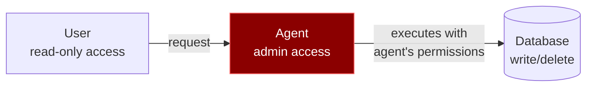
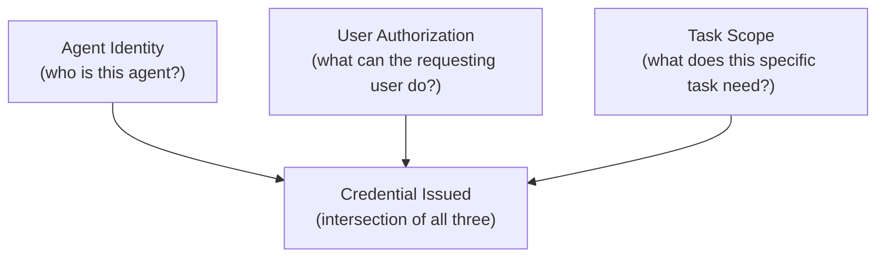

# Enterprise Zero Trust for Agentic Systems

Your developers can build secure agents. But at enterprise scale, you need **platform-level controls** that no individual agent can bypass — regardless of how it's built, configured, or compromised.

This section is for **security teams and platform engineers** deploying agentic systems across an organization.

!!! info "Repo label: High-risk reference architecture"
    The platform controls described here are a stronger starting point for organizations deploying agents at scale, but every control needs adaptation to your identity provider, network architecture, and audit requirements.

---

## The Enterprise Problem

Individual agent security (detection, prompt hardening, architecture) protects against prompt injection at the application level. But enterprises face additional challenges:

- **Hundreds of agents** running across teams, each with different tools and permissions
- **Non-human identities (NHIs)** outnumbering human identities 50:1 — and growing
- **Static credentials** scattered across repos, environment variables, and config files
- **No audit trail** connecting agent actions back to human authorizers
- **Compliance requirements** (SOC 2, HIPAA, PCI-DSS) that demand accountability

**The zero trust principle for agents: every agent is untrusted, every action is verified, every credential is ephemeral.**

---

## Non-Human Identity Management

Every agent, tool, and service must have a **verifiable identity**. No anonymous agents. No shared credentials.

### The Problem with Shared Credentials

```
❌ Agent A and Agent B both use the same DATABASE_URL
   → If either is compromised, you can't tell which one caused the breach
   → You can't revoke one without breaking the other
   → Audit logs show "database accessed" but not "by whom"
```

### The Solution

| Principle | Implementation |
|-----------|----------------|
| **Unique identity per agent** | Each agent instance gets its own identity (service account, certificate, or token) |
| **Identity propagation** | When Agent A calls Service B on behalf of User C, all three identities are tracked |
| **On-behalf-of (OBO) flows** | Agents act with the permissions of the human who authorized them, not their own elevated privileges |
| **Identity lifecycle** | Agent identities are created, rotated, and revoked through automation — never manually |

### The Confused Deputy Problem

An agent with broad permissions performs actions on behalf of a user — but doesn't enforce the user's permission boundaries. The agent becomes a "confused deputy" that escalates privileges without intending to.



**Fix:** The agent should act with the user's permissions, not its own. Use on-behalf-of token flows so the agent's actions are scoped to the requesting user's authorization level.

---

## Dynamic Credentials

Static credentials are the #1 vector for agentic exploitation. Replace them with **just-in-time, short-lived credentials**.

### Static vs. Dynamic

| | Static Credentials | Dynamic Credentials |
|---|---|---|
| **Lifetime** | Months to forever | Minutes to hours |
| **Scope** | Usually broad | Task-specific |
| **Rotation** | Manual (if ever) | Automatic |
| **If leaked** | Attacker has persistent access | Credential expires before exploitation |
| **Audit** | "Someone used the API key" | "Agent X used credential Y for task Z at time T" |

### Implementation

| Component | Approach |
|-----------|----------|
| **Database access** | Generate per-session credentials with TTL. Agent gets a database user that expires in 15 minutes |
| **API keys** | Issue scoped, short-lived tokens per task. No long-lived API keys in environment variables |
| **Cloud credentials** | Use workload identity federation (AWS IAM Roles, GCP Workload Identity) instead of static keys |
| **SSH/certificates** | Issue short-lived certificates per session. No permanent SSH keys |

### Tools

- [HashiCorp Vault](https://www.hashicorp.com/products/vault) — Dynamic secrets, PKI, credential lifecycle management
- [AWS IAM Roles Anywhere](https://docs.aws.amazon.com/rolesanywhere/latest/userguide/introduction.html) — Certificate-based credential exchange
- [SPIFFE/SPIRE](https://spiffe.io/) — Workload identity framework

---

## Least Privilege at the Credential Level

Beyond scoping what tools an agent can use, scope **what each tool can access**.

### Layered Privilege Scoping



The issued credential should be the **intersection** of:

1. What the agent is allowed to do (agent policy)
2. What the user is allowed to do (user permissions)
3. What this specific task requires (task scope)

### Examples

| Scenario | Wrong | Right |
|----------|-------|-------|
| Email agent drafting a reply | Full mailbox access, send permission | Read access to the specific thread, draft-only (no send) |
| Code agent fixing a bug | Full repo write, CI/CD trigger | Write access to the specific branch, no CI/CD |
| Data agent running a report | Full database read | Read access to specific tables, row-level filtering |

---

## Secret Scanning & Remediation

Agents generate code, write configs, and produce outputs that may inadvertently contain secrets. Scan continuously.

### What to Scan

| Source | Risk | Tool Examples |
|--------|------|---------------|
| **Git repositories** | Hard-coded API keys, database URLs, tokens | [HCP Vault Radar](https://www.hashicorp.com/products/vault/hcp-vault-radar), [GitLeaks](https://github.com/gitleaks/gitleaks), [TruffleHog](https://github.com/trufflesecurity/trufflehog) |
| **CI/CD pipelines** | Secrets in build logs, environment leakage | Pipeline secret scanning, log redaction |
| **Agent outputs** | Generated code containing secrets, LLM responses leaking context | Output filtering, canary tokens |
| **Collaboration tools** | Secrets shared in Slack, docs, tickets | Vault Radar, DLP tools |

### CI/CD Integration

```yaml
# Example: pre-commit hook to catch secrets
- repo: https://github.com/gitleaks/gitleaks
  hooks:
    - id: gitleaks
```

!!! warning "Agents are prolific secret leakers"
    Coding agents frequently hard-code credentials they find in environment variables into generated code. A developer who would never commit a secret might not notice when their AI assistant does it. Automated scanning is non-negotiable.

---

## Encrypted Communications

All agent-to-service communication must use TLS. No exceptions.

| Communication Path | Requirement |
|--------------------|-------------|
| Agent → API | TLS 1.3 |
| Agent → Database | TLS with client certificates |
| Agent → Agent (multi-agent) | mTLS (mutual TLS) |
| Agent → MCP Server | TLS with server identity verification |

**Why this matters for agents specifically:** Agents make many more API calls than humans. Each call is an opportunity for credential interception. A single unencrypted connection in a loop of 1,000 API calls is 1,000 opportunities for an attacker.

---

## Audit Trails & Compliance

Every agent action must be traceable to a **human authorizer**. This is both a security requirement and a compliance requirement.

!!! tip "Not just for enterprises"
    Audit trails matter even if you're a solo developer. When your coding agent makes 200 tool calls in a session, you need to know what it did. Enable logging in your agent's settings, review tool call histories, and check git diffs before pushing. The principles below scale from individual use to enterprise compliance.

### What to Log

| Field | Why |
|-------|-----|
| **Agent identity** | Which agent performed the action |
| **Human authorizer** | Which human authorized the agent to act |
| **Action** | What was done (tool call, API request, data access) |
| **Timestamp** | When it happened |
| **Input context** | What prompted the action (sanitized — don't log PII) |
| **Credential used** | Which dynamic credential was used |
| **Result** | Success/failure, response summary |

### Anomaly Detection

Monitor for patterns that indicate compromise:

- Unusual volume of tool calls (data exfiltration)
- Access to resources outside normal scope
- Actions at unusual times
- New external endpoints contacted
- Credential generation spikes

### Compliance Mapping

| Framework | Agentic Requirement |
|-----------|---------------------|
| **SOC 2** | Audit trail for all agent actions, access reviews |
| **HIPAA** | PHI access logging, minimum necessary standard for agent data access |
| **PCI-DSS** | No cardholder data in agent context, encrypted communications |
| **GDPR** | Data minimization in agent prompts, right to erasure applies to agent-processed data |

---

## Implementation Checklist

### Immediate (do now)

- [ ] Inventory all agent identities and credentials in your organization
- [ ] Scan repositories for hard-coded secrets
- [ ] Enable TLS on all agent-to-service connections
- [ ] Set up basic audit logging for agent actions

### Short-term (next quarter)

- [ ] Replace static credentials with dynamic/short-lived alternatives
- [ ] Implement per-agent identity with unique credentials
- [ ] Add secret scanning to CI/CD pipelines
- [ ] Establish anomaly detection baselines

### Medium-term (next 6 months)

- [ ] Implement on-behalf-of token flows for user-scoped agent actions
- [ ] Deploy mTLS for agent-to-agent communication
- [ ] Build compliance reporting for agent activities
- [ ] Automate credential lifecycle (creation, rotation, revocation)

---

## References

- [HashiCorp: Zero Trust for Agentic Systems](https://www.hashicorp.com/blog/zero-trust-for-agentic-systems-managing-non-human-identities-at-scale)
- [NHI Management Group: NHI Challenges](https://nhimg.org/nhi-challenges)
- [SPIFFE: Secure Production Identity Framework](https://spiffe.io/)
- [OWASP Top 10 for LLM Applications](https://owasp.org/www-project-top-10-for-large-language-model-applications/)
