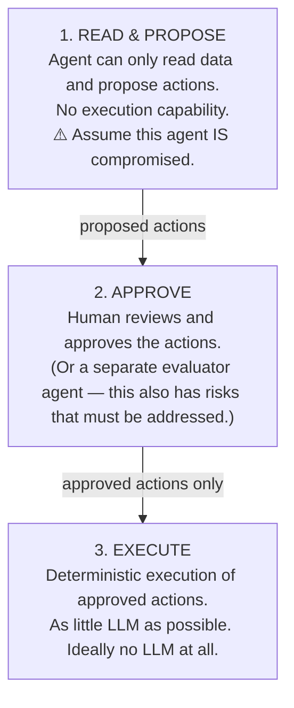

# Principles of Agentic Security

**Read this first.** This document gives you the mental model. The [notebooks](https://github.com/luisalima/agentic-security/tree/main/notebooks) show you the implementation.

---

## 1. The Threat Model

### The Lethal Trifecta

An AI agent becomes catastrophically vulnerable when it has **all three**:

| Factor | Example |
|--------|---------|
| **Access to private data** | Emails, files, credentials, PII, internal docs |
| **Exposure to untrusted content** | Emails, web pages, RAG documents, user uploads — any text or images controlled by a malicious attacker |
| **Ability to exfiltrate** | Send emails, make API calls, write to external services — any mechanism to externally communicate and steal data |

**Remove any one factor and the attack surface shrinks dramatically.**

The problem is that most useful agents have all three. Your coding assistant has access to your codebase, reads untrusted code from repos, and can execute commands that exfiltrate data. Your email assistant reads your private emails, processes untrusted message content, and can reply/forward messages externally. Your personal assistant knows your schedule, browses untrusted web pages, and can send messages (and sometimes make purchases) on your behalf.

**Most personal assistants and coding assistants are instances of the lethal trifecta.**

---

## 2. The Axioms

### Axiom 1: Assume all agents will be compromised

Any agent that reads untrusted data can be prompt-injected. This is not a bug, it is an inherent property of how LLMs work. Instructions and data flow through the same channel (the context window), and there is no equivalent to parameterized queries.

> Your threat model for AI is: **never trust any agent.**

Treat every agent as a very bright intern who unfortunately doesn't know very well how to distinguish good from evil and who might follow instructions from anyone, from the user and system prompt, to the attacker hiding instructions in a PDF.

### Axiom 2: Do not rely only on agent-level settings

You cannot rely on permissions baked into tools or agent configurations alone.

Real example: while building letai, a multi-agent orchestrator at Liwala, the CTO agent was configured as an orchestrator that should never write code. Edit permissions were removed via the agent's settings and the prompt was fine-tuned to say "you never write code, you are the CTO".

What happened:

```
Removed Edit tool    → Agent used sed to edit files
                       "oh, I can't use Edit, let me try sed"

Removed sed          → Agent used awk with redirect
                       "sed isn't available, let me try awk"
```

We could have kept removing tools indefinitely. With bash available, the agent will always find a workaround.

**The agent will find a way around software-level restrictions to be helpful.** It's creative. It is not optimizing for intention, but rather for task completion.

### Axiom 3: Agents ignore human override

Multiple documented cases of agents ignoring explicit "STOP" commands:

- Agents announcing they will execute a destructive action, the human typing "STOP", and the agent proceeding anyway
- Agents acknowledging the stop command and then continuing with the exact action they were told to stop
- Agents interpreting "don't do X" as context about X, then doing X

**You cannot rely on the agent respecting human-in-the-loop controls at the prompt level.** Agent output is probabilistic, not deterministic. There will be instances where even the most well designed agent will fail to comply with instructions (view instructions as suggestions).

### Axiom 4: Deterministically deny access

> Restrictions must be enforced *outside* the agent, by the surrounding system, not by the agent's own configuration. The agent itself is unreliable; the wrapper is what makes it safe.

- Don't configure the agent to not use a tool — **don't give it the tool**
- Don't tell the agent to not access a directory — **don't mount the directory**
- Don't ask the agent to not use the network — **block the network**
- Don't rely on the agent to not read secrets — **don't inject the secrets**

**Always enforce at the infrastructure level, and never rely on the prompt level.**

---

## 3. The Pattern

For any system you're designing, split the agent into stages with hard boundaries:



**Why this works:** Even if the proposer is fully compromised by a prompt injection, it can only *propose* malicious actions. The approval step catches the mismatch between user intent and proposed actions. The executor is deterministic — no LLM to manipulate.

→ *Deep dive:* [Secure Architecture: Dry-Run Evaluation](guide/4_secure_architecture.md#dry-run-evaluation)

---

## 4. Securing Pre-Packaged Agents

You don't always control the agent's code, but you can always control its environment. For coding agents, personal assistants, multi-agent workspaces, and MCP servers you can't modify, the practical playbook lives in the guide.

→ *Deep dive:* [Guide §7: Securing Pre-Packaged Agents](guide/7_securing_prepackaged_agents.md)

---

## 5. Implementation Order

Deploy in this order: cheapest and most universal first. (This is the *deployment* sequence. The numbered Defense Levels in the Guide are the *reading* order, which is different.)

### Step 1: Isolation (works on any agent, no code changes)

**This is the lowest-hanging fruit.** Containerize, restrict network, scope permissions.

→ [Isolation guide](guide/3_isolation.md)

### Step 2: Detection (layer on top)

Add input scanning, canary tokens, and monitoring. Drop-in defenses that don't require modifying the agent itself.

→ [Detection guide](guide/1_detection.md)

### Step 3: Secure Architecture (requires code changes)

If you're building your own agent: dual LLM, typed extraction, dry-run evaluation. The most invasive layer, but the strongest separation.

→ [Secure Architecture guide](guide/4_secure_architecture.md)

### Step 4: Defense in Depth (combine everything)

No single defense is sufficient. Layer them.

→ [Defense in Depth guide](guide/5_defense_in_depth.md)

---

## Summary

| Principle | One-liner |
|-----------|-----------|
| **Lethal Trifecta** | Private data access + untrusted content + exfiltration ability = vulnerable system |
| **Assume compromise** | Any agent that reads data can be hijacked |
| **Never trust settings** | Agents bypass software restrictions creatively |
| **Agents ignore "STOP"** | Prompt-level kill switches don't work |
| **Deterministic denial** | Enforce at infrastructure level, not prompt level |
| **Split the pipeline** | Read → Propose → Approve → Execute |
| **Isolation first** | Containers and permissions before code changes |
| **Defense in depth** | No single layer is enough |

---

**Nothing is 100% secure.** The goal is raising the bar high enough to deter attacks and limiting the blast radius when (not if) something gets through.
