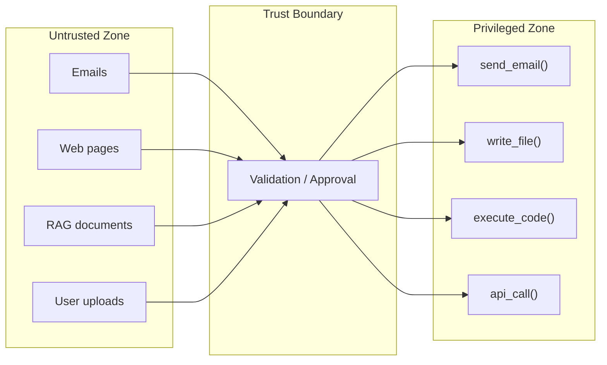

# How to Threat-Model Your Agent

Your threat model is simple: **the agent can go rogue.**

Any agent that reads untrusted data can be prompt-injected. Once injected, it will attempt to use every tool and permission it has to serve the attacker's goals. Your job is to make sure that even a fully compromised agent can't cause catastrophic damage.

---

## Step 1: Map Your Trifecta

List every component of the lethal trifecta for your system:

| Factor | Your System | Can You Remove It? |
|--------|-------------|-------------------|
| **Tools** | _List every tool the agent can call_ | Can any be removed? Made read-only? Require approval? |
| **Untrusted Input** | _List every source of external data_ | Can any be eliminated? Curated? Sandboxed? |
| **Sensitive Context** | _List every secret, credential, PII in scope_ | Can any be removed from context? Replaced with references? |

**Removing any one factor dramatically reduces risk.**

### Example: Email Assistant

| Factor | Components | Mitigation |
|--------|-----------|------------|
| **Tools** | `send_email`, `forward_email`, `read_email`, `search_contacts` | Remove `forward_email`. Require approval for `send_email` |
| **Untrusted Input** | Incoming emails (body, subject, attachments) | Process in quarantined LLM with no tool access |
| **Sensitive Context** | Contact list, email history, OAuth tokens | Only expose contacts for the current thread. Use scoped tokens |

### Example: Coding Assistant

| Factor | Components | Mitigation |
|--------|-----------|------------|
| **Tools** | `read_file`, `write_file`, `execute_code`, `bash`, `git` | Read-only by default. Require approval for writes. No `git push` |
| **Untrusted Input** | Code files, dependencies, README, PRs, issues | Run in container. Don't mount `~/.ssh`, `~/.aws` |
| **Sensitive Context** | Env vars, API keys, `.env` files, git credentials | Don't inject secrets. Use project-scoped tokens only |

---

## Step 2: Draw Your Trust Boundaries

For every data flow, ask: **where does untrusted data enter, and where do privileged actions happen?**

**The question is: what sits at the trust boundary?**

| Approach | What's at the Boundary | Strength |
|----------|----------------------|----------|
| Nothing (most agents today) | The LLM itself decides | ❌ Weakest — LLM is the vulnerability |
| Prompt engineering | System prompt instructions | ⚠️ Weak — bypassed by injection |
| Infra isolation | Container walls, network rules, filesystem mounts | ✅ Strong — deterministic |
| Software architecture | Separate LLMs, typed extraction, dry-run eval | ✅ Strong — architectural |
| Both infra + software | Defense in depth | ✅✅ Strongest |

---

## Step 3: Define Your Blast Radius

Ask: **if this agent is fully compromised right now, what's the worst that can happen?**

| Blast Radius | Example | Acceptable? |
|-------------|---------|-------------|
| Agent sends 1 email to wrong person | Scoped token, approval required | Usually yes |
| Agent exfiltrates all contacts | Full contact access, outbound network | Usually no |
| Agent pushes malicious code to prod | Git credentials, CI/CD access | Never |
| Agent deletes database | DB write credentials in env | Never |

**If the blast radius is unacceptable, you need more isolation — not better prompts.**

---

## Step 4: Choose Your Controls

Work through this checklist for your system:

### Infrastructure (do first — works on any agent)

- [ ] Agent runs in a container/VM, not on your host
- [ ] Filesystem: only necessary directories mounted, read-only where possible
- [ ] Network: outbound restricted to necessary endpoints only
- [ ] Secrets: no credentials beyond what the task requires
- [ ] Tokens: scoped, short-lived, task-specific
- [ ] Rate limits: cap on tool calls per session
- [ ] Timeout: maximum execution time
- [ ] Kill switch: infrastructure-level termination (not prompt-level)

### Software (if you control the code)

- [ ] Untrusted data processed by a separate LLM with no tool access
- [ ] Structured extraction with constrained schemas
- [ ] Outbound actions require approval (human or evaluator)
- [ ] Deterministic validation rules for high-risk actions
- [ ] Tool schemas validated against manifests

### Detection (layer on top)

- [ ] Input scanning for known injection patterns
- [ ] Canary tokens to detect data exfiltration
- [ ] Behavioral monitoring for anomalous tool usage
- [ ] Logging of all tool calls and LLM interactions

---

## Step 5: Threat-Model by Agent Type

Different agents have different risk profiles:

### Low Risk: Read-Only Agents
- Summarizers, search, Q&A over internal docs
- **Trifecta status:** No tool access (or read-only) → low risk
- **Main risk:** Data leakage through generated output
- **Controls:** Output filtering, context scoping

### Medium Risk: Internal-Only Agents
- Code assistants (no deploy), internal workflow automation
- **Trifecta status:** Tools + sensitive context, but no untrusted input → medium risk
- **Main risk:** User prompt injection, credential misuse
- **Controls:** Least privilege, scoped tokens, review before commit

### High Risk: External-Facing Agents
- Email assistants, web browsing agents, customer support bots
- **Trifecta status:** Full trifecta → high risk
- **Main risk:** Indirect prompt injection → unauthorized actions
- **Controls:** Full isolation + software architecture + detection

### Critical Risk: Autonomous Agents
- Agents that loop, plan, and execute without human oversight
- **Trifecta status:** Full trifecta + no human in loop → critical
- **Main risk:** Cascading compromise across multiple actions
- **Controls:** Everything above + mandatory approval gates + time-bound sessions

---

## The One-Line Threat Model

> **My agent can go rogue. What's the worst it can do? Make that impossible.**

Not unlikely. Not difficult. **Impossible** — enforced by infrastructure, not by prompts.

---

## References

- [Principles](../principles.md) — Core axioms and the Read → Propose → Approve → Execute pattern
- [Attack Taxonomy](attack_taxonomy.md) — Catalogue of attack vectors and risk matrix
- [Isolation notebooks](https://github.com/luisalima/agentic-security/tree/main/notebooks/3_isolation_infra_level) — Infra-level isolation patterns
- [Secure architecture notebooks](https://github.com/luisalima/agentic-security/tree/main/notebooks/4_secure_architecture_software) — Software-level defenses
